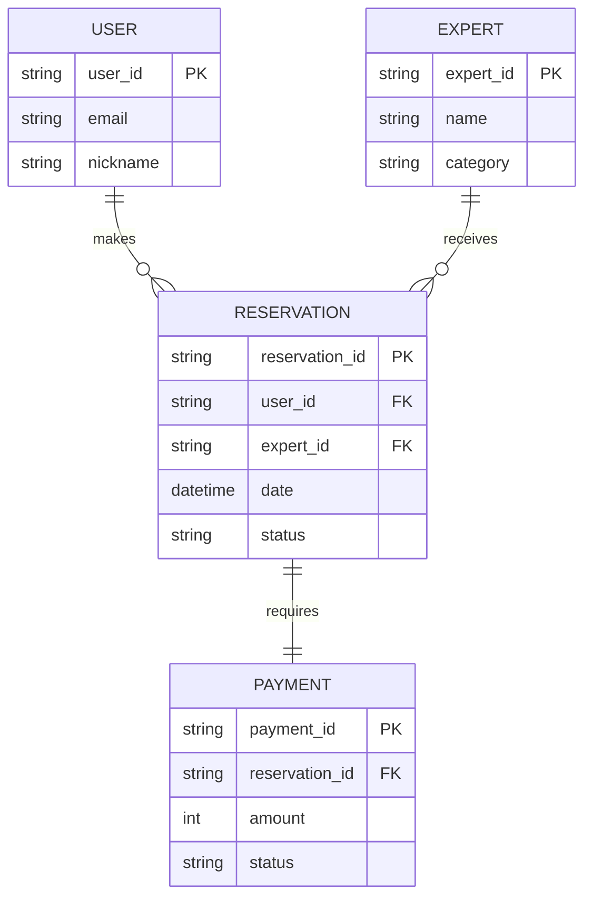

# Day 03. 기술설계 (데이터 정규화)

스타트업 개발 프로세스에서 화면 기획 이후 개발팀과 기획팀이 마주하는 가장 큰 장벽은 **"기술설계와 데이터 구조의 동기화"**입니다. 화면에 보이는 요소들이 실제 데이터베이스에 어떻게 저장되고, 용어가 문서마다 다르게 해석되거나, 데이터 구조 변경 시 어떤 영향이 생기는지 추적하는 것은 프로젝트 완성도의 핵심입니다.

Day 3 실습은 Codex AI를 활용하여 기획서와 개발 명세서 간의 데이터 구조 이해 차이를 해소(Task 01)하고, 파편화된 용어를 표준화(Task 02)하며, 설계 변경 시 아키텍처 영향 범위를 추적(Task 03)하고, 설계 의사결정(Mission 01) 및 잠재적 예외 흐름(Mission 02)을 방지하는 실전형 기술설계 파이프라인을 구축합니다.

---

# Task 01. 데이터 구조 이해 차이 해결 (Data Structure Alignment)

## 1. 스토리 및 실습 배경

스타트업의 기획 회의실. 기획자는 "사용자가 전문가 프로필을 보고 예약을 하면, 전문가는 승인이나 거절을 할 수 있고, 결제 완료 후 예약이 확정됩니다"라고 흐름을 친절히 설명했습니다. 기획자는 이 과정을 하나의 단순한 화면 흐름으로 생각했습니다.

그러나 개발자는 머릿속으로 `Users` 테이블, `Experts` 테이블, `Reservations` 테이블, `Payments` 테이블을 연상하며 이들이 1:N인지, N:M 관계인지, 상태값(Pending, Approved, Paid)은 어떻게 상호작용하는지 복잡한 관계형 모델을 구상했습니다. 이처럼 같은 서비스 정책을 두고 기획자와 개발자의 이해 차이가 생기면, 데이터베이스 설계 단계에서 누락이 발생하여 런타임 오류나 화면상의 데이터 불일치로 이어지기 쉽습니다.

이번 실습에서는 Codex를 활용하여 자연어로 작성된 기획 회의록에서 데이터 구조 관점의 엔티티와 관계를 명확히 도출하고, 두 그룹이 모두 오차 없이 일치된 설계 데이터 모델(ERD)을 이해하도록 구조화하는 방법을 학습합니다.

---

## 2. 학습 목표

* 비정형 회의 기록 및 화면 흐름 설명문에서 핵심 엔티티(Entity)를 논리적으로 도출할 수 있다.
* 엔티티 간의 관계성(Relation) 및 카디널리티(1:1, 1:N, N:M)를 명확히 정의할 수 있다.
* 도출된 관계형 데이터 구조를 Mermaid ERD 및 상세 테이블 명세서로 변환할 수 있다.
* 기획자와 개발자 간의 개념 설계 간극(Data Alignment)을 해소할 수 있다.

---

## 3. 실습 미션

학습자는 로컬 프로젝트 폴더 내에 `day3_meeting_notes.md`를 준비하고 Codex Client에 아래 프롬프트를 전송하여 데이터 설계 명세를 도출합니다.

> "제공된 회의록 내용을 데이터 구조 관점에서 분석하여 핵심 엔티티와 관계를 도출하고, 데이터 구조 정의서 및 Mermaid ERD 코드를 작성해 주세요."

---

## 4. 결과물 예시

Codex는 비정형 텍스트를 파싱하여 아래와 같은 엔티티 관계 테이블 및 ERD 코드를 빌드합니다.

### 데이터 구조 정의서 (Entity 목록)

| 엔티티명 | 설명 | 주요 속성 (Attributes) | 관계 (Relationships) |
|---|---|---|---|
| **User (사용자)** | 상담 서비스를 이용하는 일반 회원 | `user_id`, `email`, `nickname`, `status` | Reservation과 1:N 관계 |
| **Expert (전문가)** | 상담을 제공하는 파트너 전문가 | `expert_id`, `name`, `category`, `bio` | Reservation과 1:N 관계 |
| **Reservation (예약)** | 사용자-전문가 간 매핑 예약 내역 | `reservation_id`, `user_id`, `expert_id`, `date`, `status` | User/Expert와 N:1, Payment와 1:1 관계 |
| **Payment (결제)** | 예약 확정을 위한 결제 영수증 정보 | `payment_id`, `reservation_id`, `amount`, `method`, `status` | Reservation과 1:1 관계 |

### Mermaid ERD 코드 예시


---

## 5. AI 활용 포인트

* **비정형 텍스트에서 스키마 추출**: 명세서 내 명사(User, Expert)와 동사(예약하다, 결제하다)를 인식해 엔티티와 카디널리티 매핑.
* **코드 기반 시각화 연계**: 구조화된 관계형 맵을 시각 도구(Mermaid JS) 코드로 자동 빌드하여 가시성 확보.
* **이중 구조 해소**: 비개발 직군(기획자)도 쉽게 읽을 수 있는 한글 설명 테이블과 개발용 스키마 명세를 동시 제공.

---

## 6. 학습 포인트

IT 프로젝트의 가장 큰 병목은 기획서의 '회원'과 개발 명세의 'User'가 서로 연결되지 않는 논리적 격차입니다. AI를 기술설계 회의 파트너로 두면 말로 나눈 복잡한 시스템 요구사항에서 데이터 테이블 관계(ERD)를 자동으로 뽑아내어, 설계 누락을 줄이고 개발 착수 일정을 단축할 수 있습니다.

---

### 💡 교육 난이도

* **난이도:** ★★☆☆☆ (초급)
* **예상 실습 시간:** 20~30분
* **실무 활용도:** ★★★★★

---

# Task 02. 용어 표준화 (Terminology Standardization)

## 1. 스토리 및 실습 배경

프로젝트 후반부, 버그 검토 회의 중 이상한 대화가 오갑니다. 
기획자: "고객 탈퇴 화면에서 에러가 납니다."
API 개발자: "User DB에서 Delete 쿼리 날릴 때 Member 참조 무결성 오류가 발생한 것 같습니다."
화면 퍼블리셔: "화면에서는 회원라는 단어를 쓰고 있는데, 어드민 페이지에서는 고객사라고 기재되어 있네요."

이처럼 하나의 도메인 개념을 두고 기획서(회원), API 명세(User), 프론트화면(고객), DB 테이블(Member)이 서로 다른 용어를 사용하게 되면, 개발 커뮤니케이션 오차가 증폭되고 변수명이 뒤엉켜 심각한 버그의 온상이 됩니다.

이번 실습에서는 Codex를 활용하여 프로젝트 전체 명세에 흩어져 제각각으로 불리는 용어 파편화 상태를 전수 조사하고, 기획부터 DB 컬럼 정의까지 관통하는 표준화된 용어 사전(Glossary)을 구축하는 기법을 체득합니다.

---

## 2. 학습 목표

* 문서 및 설계 명세서에 사용된 도메인별 용어의 파편화 상태를 식별할 수 있다.
* 프로젝트에서 공유할 유일무이한 표준 한글명과 영문 약어(도메인 표준명)를 정의할 수 있다.
* 기획자, 개발자, 디자이너가 공통으로 준수할 표준 용어 사전을 정의할 수 있다.
* AI를 활용해 기존 레거시 단어를 논리적으로 재해석하고 변수명으로 매핑할 수 있다.

---

## 3. 실습 미션

학습자는 명세 문서 내에서 혼용되는 용어들을 파악한 후, Codex Client에 다음과 같이 용어 표준화 및 사전 구축을 지시합니다.

> "프로젝트 전반에 혼용되는 '회원/User/고객/Member', '상담사/Expert/선생님/Counselor' 등의 용어를 전수 분석하여, 프로젝트 표준 용어 사전을 Markdown 표 형태로 작성해 주세요."

---

## 4. 결과물 예시

Codex는 용어 분석 결과를 기반으로 아래와 같은 정방향 프로젝트 표준 용어 사전을 출력합니다.

### 프로젝트 표준 용어 사전

| 표준 한글명 | 표준 영문명 | 데이터 타입 | 용도 및 정의 | 기존 혼용 단어 | 추천 DB 컬럼명 |
|---|---|---|---|---|---|
| **일반회원** | User | `VARCHAR` | 서비스를 이용해 상담을 신청하는 개인 회원 | 회원, 고객, Member | `user_id` |
| **전문상담사** | Expert | `VARCHAR` | 전문 상담 지식을 제공하는 등록 파트너 | 상담사, 선생님, Counselor | `expert_id` |
| **상담예약** | Reservation | `VARCHAR` | 회원과 상담사 간 매핑된 시간 및 승인 정보 | 예약, 신청, Book | `reservation_id` |
| **예약상태** | ReservationStatus | `VARCHAR` | 대기/승인/취소/반려 등 예약의 생애주기 값 | 상태, 구분, Step | `res_status` |

---

## 5. AI 활용 포인트

* **다의어/동의어 정합**: 흩어진 문서에서 의미가 같은 대상을 파악해 단일 속성으로 클러스터링.
* **DB 네이밍 룰 준수**: 영문 네이밍 및 카멜케이스/스네이크케이스 변형 룰을 적용해 표준 DB 컬럼명 추천.
* **용어 충돌 사전 방지**: 새로운 기획안 도입 시 기존 용어 사전과 대조하여 어휘 오차 실시간 검증.

---

## 6. 학습 포인트

용어의 통일은 가독성 높은 코드를 작성하기 위한 첫 단추입니다. AI 비서를 어휘 표준화 담당자로 활용하면, 개발팀이 데이터베이스 변수명을 지을 때 불필요한 번뇌의 시간을 줄이고 기획자와 개발자가 완벽히 일치하는 업무 도메인 용어로 회의를 주도할 수 있게 됩니다.

---

### 💡 교육 난이도

* **난이도:** ★★☆☆☆ (초급)
* **예상 실습 시간:** 20~30분
* **실무 활용도:** ★★★★★

---

# Task 03. 변경 영향 공유 (Change Impact Analysis)

## 1. 스토리 및 실습 배경

데이터베이스 설계가 끝난 후 급격한 비즈니스 스펙 변경이 생겼습니다. 기존에는 '예약 후 즉시 결제'였는데, '예약 후 전문가가 승인하면 결제창이 열리는 단계형 예약'으로 변경된 것입니다. 

개발팀은 DB의 `Reservations` 테이블에 `is_approved` 컬럼을 급히 추가하고 승인 대기 상태를 넣었으나, 이 중요한 구조 변경이 API 명세서나 기획서에는 반영되지 않은 채 방치되었습니다. 이로 인해 QA 단계에서 API 파라미터 누락으로 인한 먹통 현상이 속출했고 전체 배포 일정이 지연되었습니다.

이번 실습에서는 데이터 구조나 컬럼의 변화가 발생했을 때, 이에 종속되어 연쇄 수정되어야 하는 API 규격, 화면 컴포넌트, 공유 리포트의 범위를 Codex를 활용해 전수 자동 분석하고 팀원들에게 실시간으로 공유할 리포트를 작성하는 워크플로우를 실습합니다.

---

## 2. 학습 목표

* 데이터 구조의 변경(Schema Change) 사항이 하위 모듈에 미치는 연쇄 영향 범위를 추적할 수 있다.
* 변경에 의해 즉각 개정이 필요한 API 명세서 및 화면 목록을 매핑할 수 있다.
* 변경 사항 및 영향 범위를 요약하여 팀원들에게 공지할 공유 리포트를 자동 도출할 수 있다.

---

## 3. 실습 미션

학습자는 변경 전/후 스펙을 준비한 뒤 Codex Client에 다음과 같이 지시를 전송하여 영향 범위 보고서를 생성합니다.

> "예약 확정 프로세스가 '승인 대기' 상태 추가 및 '전문가 승인 후 결제'로 변경됨에 따라 영향을 받는 API 스펙, DB 스키마, 화면 및 변경 공유 리포트를 작성해 주세요."

---

## 4. 결과물 예시

Codex는 설계 변경 건을 추적하여 영향도 분석 테이블 및 팀 공유 문구를 자동으로 빌드합니다.

### 변경 영향도 분석서

| 영향 영역 | 상세 변경 내용 | 리스크 수준 | 조치 대상 문서 및 명세 |
|---|---|---|---|
| **DB 스키마** | `Reservations` 테이블 내 `status` 공통 코드 세분화 (`WAIT_APPROVE` 추가) | **보통** | DB 물리 스키마 정의서 및 DDL 쿼리문 갱신 |
| **API 명세** | 예약 상세 조회 API Response에 `approved_at` 필드 추가, 결제 요청 API 호출 시점 조정 | **높음** | `api-specification.md` 내 예약/결제 API 엔드포인트 수정 |
| **화면 UI** | 예약 완료 페이지 내 '결제하기' 버튼 비활성화 상태 추가 및 '전문가 승인 대기' 상태창 추가 | **높음** | 회원 예약 상세 화면 기획안 & 퍼블리셔 UI 컴포넌트 수정 |

---

## 5. AI 활용 포인트

* **영향 종속성 추론**: 테이블 스키마 1줄의 변화가 시스템 전체 파이프라인(API, 화면 UI)에 미치는 기능적 여파 역추적.
* **릴리즈 노트 자동화**: 기술적인 데이터 변경 사항을 비개발 직군도 이해할 수 있는 업무 영향 보고서로 번역.
* **누락 가이드 작성**: 작업자가 놓치기 쉬운 주변 연동 코드 및 문서 동기화 지점 목록화.

---

## 6. 학습 포인트

아무리 설계를 잘해도 '변경 사항의 전파 누락'이 생기면 결국 전체 시스템이 깨집니다. 데이터 스키마 수정 시 AI 영향 분석 파이프라인을 작동시키면, 기획자와 개발자에게 각자 무엇을 고쳐야 하는지 정확히 짚어주어 통합 빌드 에러를 획기적으로 낮출 수 있습니다.

---

### 💡 교육 난이도

* **난이도:** ★★★☆☆ (중급)
* **예상 실습 시간:** 20~30분
* **실무 활용도:** ★★★★★

---

# Mission 01. 설계 의사결정 기록 (Design Decision Log)

## 1. 스토리 및 실습 배경

시간이 흘러 신규 개발자가 합류하여 소스 코드를 보다가 의문을 가집니다. "왜 예약 취소 이력 테이블을 굳이 메인 예약 테이블과 1:1로 찢어놓지 않고 예약 상태값만 바꿔서 이력 누적 테이블을 따로 파놓았을까? 그냥 컬럼 하나 추가하는 게 편했을 텐데."

이유는 6개월 전 보안/감사 요건 충족 및 일일 예약 취소 통계 집계 성능 최적화를 위해 시니어 엔지니어와 기획자가 심사숙고해 결정한 사안이었습니다. 하지만 이를 기록해 둔 문서가 전혀 없었기 때문에, 신규 개발자는 마음대로 설계를 뒤엎었다가 과거의 취소 통계 대시보드가 통째로 마비되는 장애를 일으켰습니다.

이번 미션에서는 기술설계 단계에서 진행된 데이터 정규화 및 아키텍처 의결 배경을 Codex를 활용해 정형화된 **Design Decision Log** 문서로 작성하여, 시스템의 역사적 자산과 설계 근거(Why)를 안전하게 관리하는 법을 배웁니다.

---

## 2. 실습 미션

학습자는 Codex Client에 아래 지시 사항과 함께 회의 대화 기록을 보냅니다.

> "회의 내용에서 정규화 및 데이터베이스 구조 설계 결정을 추출하여, 결정 항목, 배경 사유, 대안 검토, 승인자, 향후 변경 가능성을 포함하는 Design Decision Log를 작성해 주세요."

---

## 3. 결과물 예시

### Design Decision Log (설계 의사결정 기록)

* **결정 ID**: `DEC-003`
* **결정 사항**: 예약 취소 이력을 `Reservations` 테이블에 직접 누적하지 않고 별도의 `Reservation_Histories` 테이블로 1:N 분리 설계.
* **의결 배경 (Why)**:
  1. 상담 예약의 생애주기 중 상태 변경(대기 ➔ 승인 ➔ 취소)이 잦아 메인 테이블의 쓰기 잠금(Write Lock) 병목을 방지함.
  2. 일자별/상담사별 이력 추적 및 취소 사유 감사를 위한 데이터 이력 보존 요건 충족.
* **검토된 대안**:
  - *대안 1*: 메인 Reservations 테이블에 `canceled_at`, `cancel_reason` 컬럼을 직접 추가. (기각: 다중 변경 이력 기록 불가 및 테이블 비대화 리스크)
* **승인 주체**: PM 및 Lead Engineer (승인자: Dev_Lead)
* **향후 변경 가능성**: 차기 서비스 스케일에 따라 NoSQL 로그성 데이터베이스(Document DB)로 이력 이관 가능성 있음.

---

## 4. AI 활용 포인트

* **결정의 역사화**: 구두 합의나 휘발성 논쟁에서 아키텍처적 결론과 그에 매핑되는 타협 근거(Reasoning) 추출.
* **대안 기각 사유 보존**: 채택되지 않은 대안들의 한계점과 리스크를 명기하여 추후 중복 회의 방지.
* **표준 로깅 템플릿 구조화**: 비정형 아키텍처 의사결정을 PM 및 후임자가 추적 가능한 표준 포맷으로 인덱싱.

---

### 💡 교육 난이도

* **난이도:** ★★☆☆☆ (초급)
* **예상 실습 시간:** 20~30분
* **실무 활용도:** ★★★★★

---

# Mission 02. 예외 시나리오 발굴 (Edge Case Discovery)

## 1. 스토리 및 실습 배경

스타트업이 MVP 제품을 성공적으로 론칭한 첫날 밤, 예상치 못한 서버 알람이 울립니다. 똑같은 예약 시간대에 두 명의 사용자가 동시에 결제 버튼을 눌렀고, 결제는 둘 다 성공했는데 데이터베이스에는 마지막 결제자만 덮어쓰기되어 첫 번째 결제자의 예약 데이터가 공중으로 사라진 것입니다. (동시성 제어 예외 상황)

또한, 회원 탈퇴를 한 사용자의 DB 레코드를 물리적으로 완전히 삭제(Hard Delete)했더니, 기존에 그 사용자가 결제했던 과거 매출 데이터의 `user_id` 외래키 참조 무결성이 깨져 일일 정산 매출 통계 쿼리 실행이 중단되는 끔찍한 연쇄 장애도 발생했습니다.

설계 단계에서 이러한 비정상 흐름이나 예외 상황(Edge Cases)을 꼼꼼하게 예측하여 데이터 무결성 규칙을 세워두지 않으면 제품 배포 후 치명적인 비즈니스 손실을 입게 됩니다. 이번 미션에서는 구축된 데이터 모델을 기준으로 발생 가능한 데이터 왜곡 및 잠재적 예외 케이스를 Codex를 가동해 사전에 전수 도출하고 대응 방안을 선제 설계하는 기법을 체득합니다.

---

## 2. 실습 미션

학습자는 정의한 ERD 명세와 컬럼 스키마를 Codex Client에 주입하고 아래와 같이 예외 시나리오 추출을 요구합니다.

> "현재 정의된 User, Expert, Reservation, Payment 테이블 구조에서 발생할 수 있는 데이터 정합성 위배 Edge Case 예외 시나리오를 도출하고 개선 방안을 제시해 주세요."

---

## 3. 결과물 예시

### Edge Case 분석 보고서

| 예외 분류 | 발생 가능 시나리오 (Edge Case) | 시스템 영향도 | 권장 개선 방안 (데이터 설계 보완) |
|---|---|---|---|
| **동시성 오류** | 동일 전문가의 같은 상담 시간대에 두 명의 사용자가 동시 결제를 시도하여 예약이 중복 매핑되는 상황 | **치명적 (High)** | 데이터베이스 예약 트랜잭션 시 `UNIQUE` 제약 조건 추가 및 분산 락(Distributed Lock) 도입 |
| **참조 무결성** | 기존 예약 및 결제 이력이 존재하는 회원이 탈퇴할 때 `Hard Delete`로 인해 외래키 관계가 깨지는 상황 | **치명적 (High)** | 탈퇴 처리 시 실제 데이터를 지우지 않고 `status = 'DELETED'` 처리하는 논리 삭제(Soft Delete) 스키마 변경 |
| **데이터 불일치** | 외부 PG사 결제는 성공했으나 네트워크 단절로 인해 우리 데이터베이스 결제(Payment) 데이터 인서트에 실패한 상태 | **높음 (Medium)** | 결제 API와 DB 처리를 하나의 분산 트랜잭션(Saga Pattern)으로 묶고, 미결제 대기 건 배치 확인 로직 구축 |

---

## 4. AI 활용 포인트

* **설계 취약점 화이트박스 검증**: 스키마 구조 및 참조 관계를 분석하여 외래키 널(Null) 허용 조건이나 논리 충돌 구간 자율 탐색.
* **장애 시나리오 역발상 도출**: 개발자가 경험적으로 놓치기 쉬운 트랜잭션 실패, 동시 쓰기, 논리 삭제에 따른 통계 불일치 케이스 도출.
* **대처 알고리즘 제안**: 발견된 취약점에 매핑되는 구체적인 DB 엔지니어링 해법(Soft Delete, Unique 제약, 트랜잭션 격리 등) 제시.

---

### 💡 교육 난이도

* **난이도:** ★★★★☆ (상급)
* **예상 실습 시간:** 20~30분
* **실무 활용도:** ★★★★★

---

# Day 03 교육 구성 및 마일스톤

| 구분 | 주제 | Codex AI 핵심 액션 | 학습 기대 산출물 |
|---|---|---|---|
| **Task 01** | 데이터 구조 이해 차이 해결 | 기획 회의록에서 엔티티 및 카디널리티 관계 추출 및 ERD화 | `erd-schema.md` / Mermaid ERD |
| **Task 02** | 용어 표준화 | 기획/API/DB에서 제각각으로 불리는 파편화 단어의 표준 어휘 사전 생성 | `project-glossary.md` (표준 용어 사전) |
| **Task 03** | 변경 영향 공유 | 데이터 설계 규격 변경 시 동기화되어야 할 API & UI 화면 명세 매핑 | `change-impact-report.md` |
| **Mission 01** | 설계 의사결정 기록 | 아키텍처 정규화 설계 의사결정 기록 보존 (Why 로깅) | `design-decision-log.md` |
| **Mission 02** | 예외 시나리오 발굴 | 동시성, 참조 무결성 붕괴, 논리 삭제에 대응하는 예외 대응 설계 | `edge-case-analysis.md` |

Day 3의 5가지 핵심 교육 모듈은 단순히 데이터베이스 지식을 외우는 교육이 아닙니다. Codex AI를 기술 설계 자문역으로 배치하여 **"데이터 모델 합의 ➔ 용어 통일 ➔ 변경 통제 ➔ 결정 로깅 ➔ 예외 대응"**으로 정교하게 짜인 아키텍처 협업 흐름을 수행함으로써, 기획자와 개발자가 단 1픽셀의 커뮤니케이션 오차도 없이 완성도 높은 서비스를 향해 도약할 수 있는 최고급 설계 역량을 획득하게 됩니다.


# Day 03 실습용 원본 파일 데이터 내역

실습실에서 다운로드받아 사용하는 5가지 핵심 마크다운 원본 자료들의 텍스트 데이터 내역입니다.

## 📄 day3_meeting_notes.md
```markdown
# 온라인 전문가 상담 서비스 기획 회의록 (7월 1주차)

* **회의 취지**: 핵심 서비스 이용자 행동 시나리오 정의
* **서비스 흐름**:
  1. 일반 회원은 이메일과 닉네임을 사용해 가입한다. 가입 시 기본 상태는 '활동' 상태이다.
  2. 전문 파트너는 이름과 상담 전문 분야(카테고리), 자기소개를 등록하여 상담사 등록을 완료한다.
  3. 사용자는 등록된 전문가 목록을 보고 원하는 날짜에 맞춰 상담 예약을 신청한다. 예약 신청 시 예약 상태는 '대기' 상태로 지정된다.
  4. 예약 신청이 접수되면 예약 내역에 대한 결제가 필요하다. 결제 수단(신용카드 등) 및 결제 금액을 결제 테이블에 기록하고 결제가 승인되면 예약 상태는 '확정'으로 갱신된다.
```

## 📄 fragmented-terms.md
```markdown
# 프로젝트 파편화 용어 관리 문서

* **Figma UI 기획서의 표기**:
  - 사용자 정보 화면: '고객명', '탈퇴회원'
  - 전문가 매칭 카드: '선생님 프로필', '전문 상담사 분야'
  - 예약 폼: '상담 신청 시간', '예약 구분'

* **백엔드 API 명세서의 표기**:
  - GET /user/profile -> 'nickname', 'MemberStatus'
  - POST /counselor/register -> 'CounselorName', 'category'
  - GET /book/history -> 'book_id', 'status'

* **데이터베이스 SQL DDL의 표기**:
  - TABLE members -> 'member_id', 'email', 'nick_name'
  - TABLE counselors -> 'counselor_id', 'name'
  - TABLE reservations -> 'res_id', 'user_id', 'counselor_id'
```

## 📄 schema-change-request.md
```markdown
# 요구사항 변경 요청서 (Change Request)

* **요청 제목**: 예약 확정 프로세스 고도화 및 먹튀 방지 승인 단계 도입
* **변경 전 (v1.0)**:
  - 사용자가 예약 신청 시 결제 금액을 입력하고 즉시 결제를 진행함. 결제 완료와 동시에 예약 확정.
* **변경 후 (v2.0)**:
  - 사용자는 예약을 '신청'만 하고 대기한다. (DB: status = 'WAIT_APPROVE')
  - 전문가가 해당 상담 요청의 주제를 검토한 후 '승인(Approve)' 처리를 해야 사용자의 결제창이 활성화된다.
  - 사용자가 결제를 완료하면 비로소 예약 상태는 '확정(CONFIRMED)'으로 변경된다.
```

## 📄 tech-design-meeting.md
```markdown
# 아키텍처 설계 및 데이터베이스 정규화 결정 회의록

* **참석자**: PM_David, Dev_Lead, DB_Admin
* **안건**: 예약 취소 이력 관리 및 결제 테이블 1:1 분리 타당성 검토
* **회의 기록**:
  - **Dev_Lead**: 기존 Reservations 테이블에 그냥 'canceled_at'이랑 'cancel_reason' 컬럼만 뚫어서 상태값 'CANCELED'로 하면 편하지 않나요?
  - **DB_Admin**: 서비스 특성상 사용자가 일정을 변경하며 취소를 여러 번 할 수도 있어서, 컬럼 직접 추가는 다중 이력 처리가 불가능합니다. 그리고 취소 로그 조회량이 일일 예약 건수 조회보다 현저히 적은데 메인 테이블에 계속 데이터를 쌓아두면 테이블 전체에 락(Lock) 병목이 생길 겁니다.
  - **Dev_Lead**: 아, 그렇군요. 그럼 메인 예약 테이블은 최신 상태만 유지하고, 취소 및 이력은 'Reservation_Histories' 테이블로 1:N 분리 설계하는 게 타당하겠네요.
  - **PM_David**: 좋은 생각입니다. 통계 집계 성능과 보안 감사 용건을 위해 그 대안으로 진행합시다. 내가 최종 컨펌하고 승인합니다.
```

## 📄 database-schema.md
```markdown
# 전문가 상담 서비스 물리 데이터베이스 스키마 정의

```sql
CREATE TABLE Users (
    user_id VARCHAR(50) PRIMARY KEY,
    email VARCHAR(100) NOT NULL,
    nickname VARCHAR(50) NOT NULL
);

CREATE TABLE Experts (
    expert_id VARCHAR(50) PRIMARY KEY,
    name VARCHAR(50) NOT NULL,
    category VARCHAR(50) NOT NULL
);

CREATE TABLE Reservations (
    reservation_id VARCHAR(50) PRIMARY KEY,
    user_id VARCHAR(50) NOT NULL,
    expert_id VARCHAR(50) NOT NULL,
    reservation_date DATETIME NOT NULL,
    status VARCHAR(20) NOT NULL,
    FOREIGN KEY (user_id) REFERENCES Users(user_id),
    FOREIGN KEY (expert_id) REFERENCES Experts(expert_id)
);

CREATE TABLE Payments (
    payment_id VARCHAR(50) PRIMARY KEY,
    reservation_id VARCHAR(50) NOT NULL,
    amount INT NOT NULL,
    status VARCHAR(20) NOT NULL,
    FOREIGN KEY (reservation_id) REFERENCES Reservations(reservation_id)
);
```
```
