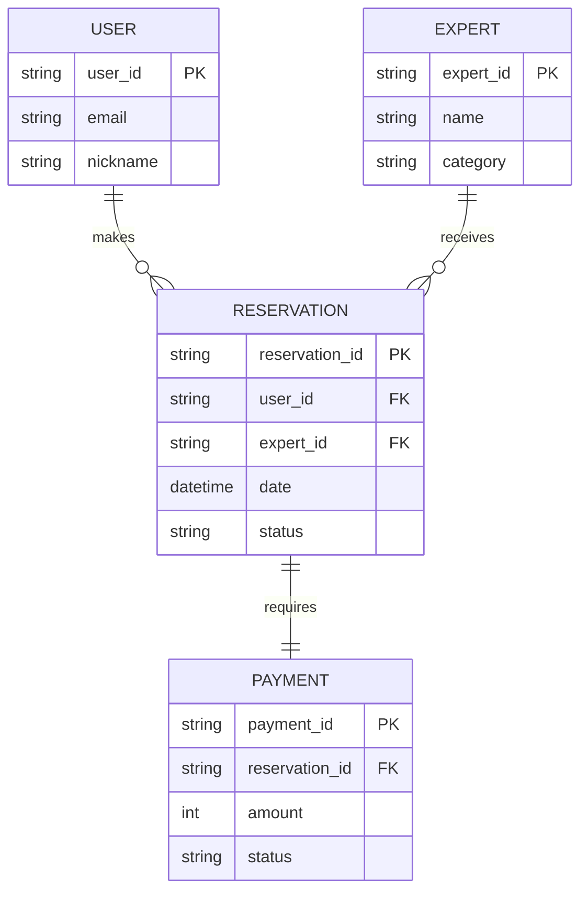

# Day 03. Technical design (data normalization)

In the startup development process, the biggest barrier that the development and planning teams face after screen planning is **"synchronization of technical design and data structure"**. Tracking how elements visible on the screen are stored in the actual database, how terms are interpreted differently in each document, or what effects occur when data structures are changed is key to project completeness.

Day 3 practice utilizes Codex AI to resolve the gap in data structure understanding between the plan and development specification (Task 01), standardize fragmented terms (Task 02), track the scope of architectural impact when design changes (Task 03), and build a practical technical design pipeline that prevents design decisions (Mission 01) and potential exception flows (Mission 02).

---

# Task 01. Resolving differences in data structure understanding (Data Structure Alignment)

## 1. Story and practice background

Startup planning meeting room. The planner kindly explained the flow, saying, “When a user views an expert’s profile and makes a reservation, the expert can approve or decline, and the reservation is confirmed after payment is completed.” The planner thought of this process as one simple screen flow.

However, the developer envisioned a complex relational model by mentally recalling the `Users` table, `Experts` table, `Reservations` table, and `Payments` table, whether they are 1:N or N:M relationships, and how the status values (Pending, Approved, Paid) interact. If there is a difference in understanding between planners and developers regarding the same service policy, omissions can easily occur at the database design stage, leading to runtime errors or data inconsistencies on the screen.

In this exercise, you will learn how to use Codex to clearly derive entities and relationships from a data structure perspective from planning meeting minutes written in natural language and structure them so that both groups understand the consensus design data model (ERD) without error.

---

## 2. Learning objectives

* Key entities can be logically derived from unstructured meeting records and screen flow descriptions.
* Relationships and cardinality (1:1, 1:N, N:M) between entities can be clearly defined.
* The derived relational data structure can be converted to Mermaid ERD and detailed table specifications.
* The concept design gap (data alignment) between planners and developers can be resolved.

---

## 3. Practice mission

Learners prepare `day3_meeting_notes.md` in the local project folder and send the prompt below to the Codex Client to derive the data design specification.

> "Please analyze the provided meeting minutes from a data structure perspective to derive key entities and relationships, and write a data structure definition and Mermaid ERD code."

---

## 4. Example of results

Codex parses unstructured text to build an entity relationship table and ERD code, as shown below.

### Data structure definition (Entity list)

| Entity name | Description | Key Attributes | Relationships |
|---|---|---|---|
| **User** | General members using counseling services | `user_id`, `email`, `nickname`, `status` | Reservation and 1:N relationship |
| **Expert** | Partner experts providing consultation | `expert_id`, `name`, `category`, `bio` | Reservation and 1:N relationship |
| **Reservation** | User-to-Expert Mapping Reservation History | `reservation_id`, `user_id`, `expert_id`, `date`, `status` | N:1 relationship with User/Expert, 1:1 relationship with Payment |
| **Payment** | Payment receipt information to confirm reservation | `payment_id`, `reservation_id`, `amount`, `method`, `status` | Reservation and 1:1 relationship |

### Mermaid ERD code example


---

## 5. AI utilization points

* **Schema extraction from unstructured text**: Recognizes nouns (User, Expert) and verbs (reserve, pay) in the specification and maps entities and cardinality.
* **Code-based visualization linkage**: Automatically builds structured relational maps into visual tool (Mermaid JS) code to ensure visibility.
* **Resolution of dual structure**: Simultaneous provision of a Korean explanation table and schema specification for development that can be easily read even by non-development professionals (planners).

---

## 6. Learning points

The biggest bottleneck in IT projects is the logical gap where 'members' in the plan and 'Users' in the development specifications are not connected. By having AI as your technical design meeting partner, you can automatically extract data table relationships (ERD) from complex verbal system requirements, reducing design omissions and shortening the development start schedule.

---

### 💡 Training Difficulty

* **Difficulty:** ★★☆☆☆ (Beginner)
* **Estimated lab time:** 20-30 minutes
* **Practical usability:** ★★★★★

---

# Task 02. Terminology Standardization

## 1. Story and practice background

Late in the project, a strange conversation occurs during a bug review meeting. 
Planner: “An error occurred on the customer withdrawal screen.”
API Developer: "It seems that a Member referential integrity error occurred when making a Delete query in the User DB."
Screen publisher: “On the screen, the word ‘member’ is used, but on the admin page, it says ‘customer.’”

In this way, if different terms are used for a single domain concept such as plan (member), API specification (User), front screen (customer), and DB table (Member), errors in development communication are amplified and variable names become intertwined, creating a breeding ground for serious bugs.

In this exercise, you will use Codex to fully investigate the fragmentation of different terminologies scattered across the entire project specification, and learn techniques for building a standardized terminology dictionary that goes from planning to DB column definitions.

---

## 2. Learning objectives

* The fragmentation status of domain-specific terms used in documents and design specifications can be identified.
* You can define a unique standard Korean name and English abbreviation (domain standard name) to be shared in the project.
* A dictionary of standard terms to be commonly followed by planners, developers, and designers can be defined.
* Using AI, existing legacy words can be logically reinterpreted and mapped to variable names.

---

## 3. Practice mission

After identifying terms that are used interchangeably within the specification document, the learner instructs the Codex Client to standardize terms and build a dictionary as follows.

> "Please analyze terms such as 'Member/User/Customer/Member' and 'Counselor/Expert/Teacher/Counselor' that are used interchangeably throughout the project and create a dictionary of standard project terms in the form of a Markdown table."

---

## 4. Example of results

Codex outputs the following forward project standard terminology dictionary based on the terminology analysis results.

### Project Standard Glossary

| Standard Korean name | Standard English name | data type | Uses and Definitions | Existing mixed words | Recommended DB column name |
|---|---|---|---|---|---|
| **General Member** | User | `VARCHAR` | Individual members who apply for consultation using the service | Member, Customer, Member | `user_id` |
| **Professional Counselor** | Expert | `VARCHAR` | Registered partners providing expert consulting knowledge | counselor, teacher, counselor | `expert_id` |
| **Consultation Reservation** | Reservation | `VARCHAR` | Mapped hours and authorization information between member and agent | Reservation, Application, Book | `reservation_id` |
| **Reservation Status** | ReservationStatus | `VARCHAR` | Life cycle value of reservations such as waiting/approval/cancellation/rejection, etc. | Status, Category, Step | `res_status` |

---

## 5. AI utilization points

* **Polysemy/Synonym Matching**: Identify objects with the same meaning from scattered documents and cluster them into a single attribute.
* **Compliance with DB naming rules**: Recommend standard DB column names by applying English naming and camel case/snake case transformation rules.
* **Terminology conflict dictionary prevention**: Real-time verification of vocabulary errors by comparing with the existing terminology dictionary when introducing a new plan.

---

## 6. Learning points

Unification of terminology is the first step to writing highly readable code. Using an AI assistant as a vocabulary standardizer will reduce the development team's unnecessary hassle when naming database variables and allow planners and developers to lead meetings with perfectly matching business domain terms.

---

### 💡 Training Difficulty

* **Difficulty:** ★★☆☆☆ (Beginner)
* **Estimated lab time:** 20-30 minutes
* **Practical usability:** ★★★★★

---

# Task 03. Change Impact Analysis

## 1. Story and practice background

After the database design was completed, the business specifications changed drastically. Previously, it was 'immediate payment after reservation', but it has been changed to 'step reservation where the payment window opens when the expert approves after reservation.' 

The development team hastily added the `is_approved` column to the DB's `Reservations` table and put it in a waiting for approval state, but this important structural change was left without being reflected in the API specification or plan. As a result, problems occurred due to missing API parameters during the QA stage, and the entire deployment schedule was delayed.

In this exercise, we will practice the workflow of using Codex to automatically analyze the scope of API specifications, screen components, and shared reports that depend on and need to be serially modified when changes occur in data structure or columns, and create a report to be shared with team members in real time.

---

## 2. Learning objectives

* You can track the scope of chain effects of data structure changes (Schema Changes) on sub-modules.
* You can map API specifications and screen lists that require immediate revision due to changes.
* You can automatically create a shared report that summarizes changes and scope of impact and notifies team members.

---

## 3. Practice mission

The learner prepares the specifications before and after the change and then sends the following instructions to the Codex Client to generate the scope of impact report.

> "Please fill out the API specifications, DB schema, screens, and change sharing reports that are affected as the reservation confirmation process has been changed to 'Awaiting Approval' status added and 'Payment after expert approval'."

---

## 4. Example of results

Codex tracks design changes and automatically builds impact analysis tables and team sharing statements.

### Change Impact Analysis

| Area of ​​influence | Detailed changes | Risk level | Documents and specifications subject to action |
|---|---|---|---|
| **DB Schema** | Refine common code for `status` in `Reservations` table (add `WAIT_APPROVE`) | **Average** | DB physical schema definition and DDL query statement update |
| **API Specification** | Added `approved_at` field to reservation detail inquiry API response, adjusted payment request API call timing | **High** | Edit reservation/payment API endpoint in `api-specification.md` |
| **Screen UI** | Added a disabled status for the 'Pay' button on the reservation completion page and added a 'Waiting for expert approval' status window | **High** | Member reservation details screen plan & publisher UI component modification |

---

## 5. AI utilization points

* **Impact Dependency Inference**: Trace back the functional impact of a single line change to the table schema on the entire system pipeline (API, screen UI).
* **Release Note Automation**: Translate technical data changes into business impact reports that even non-development professionals can understand.
* **Create a missing guide**: List peripheral integration code and document synchronization points that workers tend to miss.

---

## 6. Learning points

No matter how well designed it is, if there is ‘missing propagation of changes’, the entire system will eventually break. By running the AI ​​impact analysis pipeline when modifying the data schema, you can dramatically reduce integration build errors by pointing out exactly what needs to be fixed to planners and developers.

---

### 💡 Training Difficulty

* **Difficulty:** ★★★☆☆ (Intermediate)
* **Estimated lab time:** 20-30 minutes
* **Practical usability:** ★★★★★

---

# Mission 01. Design Decision Log

## 1. Story and practice background

As time passes, new developers join, look at the source code, and have questions. “Why did you create a separate history accumulation table by only changing the reservation status value instead of dividing the reservation cancellation history table 1:1 from the main reservation table? It would have been easier to just add a column.”

The reason was a thoughtful decision made by senior engineers and planners 6 months ago to meet security/audit requirements and optimize the performance of daily reservation cancellation statistics. However, because there was no documentation to record this, the new developer was able to overturn the design at will, causing a failure that completely paralyzed the previous cancellation statistics dashboard.

In this mission, you will learn how to safely manage the historical assets and design basis (Why) of the system by writing the background of data normalization and architectural decision made in the technical design stage into a standardized **Design Decision Log** document using Codex.

---

## 2. Practice mission

Learners send a transcript of the meeting conversation to the Codex Client along with the instructions below.

> "Please extract normalization and database structure design decisions from the meeting and create a Design Decision Log that includes decision items, background reasons, alternatives reviewed, approvers, and possible future changes."

---

## 3. Example of results

### Design Decision Log

* **Decision ID**: `DEC-003`
* **Decision**: Reservation cancellation history is designed to be 1:N separated into a separate `Reservation_Histories` table rather than directly accumulating it in the `Reservations` table.
* **Background to decision (Why)**:
  1. Prevents the write lock bottleneck of the main table due to frequent status changes (waiting ➔ approval ➔ cancellation) during the life cycle of a consultation reservation.
  2. Satisfying data history retention requirements for tracking history by date/counselor and auditing reasons for cancellation.
* **Alternatives considered**:
  - *Alternative 1*: Add `canceled_at` and `cancel_reason` columns directly to the main Reservations table. (Dismissed: Impossibility to record multiple change history and risk of table failure)
* **Approved by**: PM and Lead Engineer (Approved by: Dev_Lead)
* **Possibility of future change**: Depending on the next service scale, there is a possibility of history being transferred to a NoSQL logarithmic database (Document DB).

---

## 4. AI utilization points

* **Historicization of decisions**: Extracting architectural conclusions and the compromise rationale that maps to them from oral agreements or volatile arguments.
* **Preservation of reasons for rejecting alternatives**: Prevent duplicate meetings in the future by specifying the limitations and risks of alternatives that were not adopted.
* **Structure standard logging templates**: Index unstructured architectural decisions into a standard format that can be traced by PMs and their successors.

---

### 💡 Training Difficulty

* **Difficulty:** ★★☆☆☆ (Beginner)
* **Estimated lab time:** 20-30 minutes
* **Practical usability:** ★★★★★

---

# Mission 02. Edge Case Discovery

## 1. Story and practice background

On the first night of a startup's successful launch of its MVP product, an unexpected server alarm sounds. Two users pressed the payment button at the same time during the same reservation time slot, and both payments were successful, but only the last payer was overwritten in the database, and the first payer's reservation data disappeared into the air. (Concurrency control exception situation)

In addition, when the DB record of a user who had withdrawn from membership was physically completely deleted (Hard Delete), the referential integrity of the `user_id` foreign key of the past sales data that the user had previously paid was broken, resulting in a terrible chain failure in which the execution of daily settlement sales statistics queries was halted.

If you do not carefully predict these abnormal flows or edge cases at the design stage and establish data integrity rules, you will suffer fatal business losses after product deployment. In this mission, based on the constructed data model, we will operate Codex to identify possible data distortions and potential exception cases in advance, and learn techniques to preemptively design response plans.

---

## 2. Practice mission

The learner injects the defined ERD specification and column schema into the Codex Client and requests exception scenario extraction as shown below.

> "Please derive data consistency violation edge case exception scenarios that may occur in the currently defined User, Expert, Reservation, and Payment table structures and suggest improvement measures."

---

## 3. Example of results

### Edge Case Analysis Report

| Exception classification | Possible Scenario (Edge Case) | System Impact | Recommended improvement plan (data design supplement) |
|---|---|---|---|
| **Concurrency Error** | A situation where two users attempt to make a payment at the same time during the same consultation time slot with the same expert, resulting in duplicate reservation mapping | **Fatal (High)** | Addition of `UNIQUE` constraint and introduction of distributed lock during database reservation transaction |
| **Referential Integrity** | A situation in which the foreign key relationship is broken due to ‘Hard Delete’ when a member with existing reservation and payment history withdraws | **Fatal (High)** | Changed logical deletion (Soft Delete) schema that processes `status = 'DELETED'` without deleting actual data when processing withdrawal |
| **Data Inconsistency** | Payment to external PG company was successful, but payment data insertion into our database failed due to network disconnection | **High (Medium)** | Bundle payment API and DB processing into one distributed transaction (Saga Pattern), and build logic to confirm batches of outstanding pending cases |

---

## 4. AI utilization points

* **Design vulnerability white box verification**: Autonomous search for foreign key nullability conditions or logical conflict sections by analyzing schema structure and reference relationships.
* **Drawing contrarian thinking in failure scenarios**: Deriving cases of statistical inconsistency due to transaction failure, concurrent writing, and logical deletion that developers can easily miss through experience.
* **Proposal of response algorithm**: Proposal of specific DB engineering solutions (Soft Delete, Unique constraints, transaction isolation, etc.) that map to discovered vulnerabilities.

---

### 💡 Training Difficulty

* **Difficulty:** ★★★★☆ (Advanced)
* **Estimated lab time:** 20-30 minutes
* **Practical usability:** ★★★★★

---

# Day 03 Training Organization and Milestones

| Category | Topic | Codex AI Core Actions | Learning Expected Outcomes |
|---|---|---|---|
| **Task 01** | Addressing gaps in understanding data structures | Extracting and ERDing entities and cardinality relationships from planning meeting minutes | `erd-schema.md` / Mermaid ERD |
| **Task 02** | Terminology standardization | Creating a standard vocabulary dictionary of fragmented words called differently in planning/API/DB | `project-glossary.md` (standard glossary) |
| **Task 03** | Share the impact of change | API & UI screen specification mapping that must be synchronized when data design specifications change | `change-impact-report.md` |
| **Mission 01** | Design decision history | Architecture Normalization Design Decision Record Preservation (Why Logging) | `design-decision-log.md` |
| **Mission 02** | Excavating Exception Scenarios | Exception response design for concurrency, referential integrity collapse, and logical deletion | `edge-case-analysis.md` |

Day 3's five core training modules are not simply about memorizing database knowledge. By deploying Codex AI as a technical design advisor and carrying out a carefully structured architectural collaboration flow of **"data model agreement ➔ terminology unification ➔ change control ➔ decision logging ➔ exception response"**, planners and developers acquire the highest level of design capabilities that can take a leap toward a high-quality service without even a single pixel of communication error.


# Day 03 Original file data history for practice

This is the text data details of the five core Markdown source materials downloaded and used in the lab.

## 📄 day3_meeting_notes.md
```markdown
# Online expert consultation service planning meeting minutes (1st week of July)

* **Purpose of the meeting**: Define key service user behavior scenarios
* **Service Flow**:
  1. General members sign up using their email address and nickname. The default status when signing up is 'Active' status.
  2. Professional partners register as counselors by registering their name, counseling specialty (category), and self-introduction.
  3. The user views the list of registered experts and applies for a consultation appointment on the desired date. When applying for a reservation, the reservation status is designated as 'waiting' status.
  4. Once a reservation request is received, payment for the reservation details is required. The payment method (credit card, etc.) and payment amount are recorded on the table, and once the payment is approved, the reservation status is updated to 'confirmed'.
```

## 📄 fragmented-terms.md
```markdown
# project fragmentation terminology management document

* **Notation in Figma UI planning**:
  - User information screen: ‘Customer name’, ‘Withdrawal member’
  - Expert matching card: ‘Teacher profile’, ‘Professional counselor field’
  - Reservation form: ‘Consultation application time’, ‘Reservation Category’

* **Notation in backend API specification**:
  - GET /user/profile -> 'nickname', 'MemberStatus'
  - POST /counselor/register -> 'CounselorName', 'category'
  - GET /book/history -> 'book_id', 'status'

* **Notation of database SQL DDL**:
  - TABLE members -> 'member_id', 'email', 'nick_name'
  - TABLE counselors -> 'counselor_id', 'name'
  - TABLE reservations -> 'res_id', 'user_id', 'counselor_id'
```

## 📄 schema-change-request.md
```markdown
# Requirements Change Request

* **Request Title**: Reservation confirmed Process advancement and introduction of approval stage to prevent fraud
* **Before change (v1.0)**:
  - When applying for a reservation, the user enters the payment amount and proceeds with payment immediately. Reservation confirmed upon payment completion.
* **After change (v2.0)**:
  - Users only ‘apply’ for a reservation and then wait. (DB: status = 'WAIT_APPROVE')
  - The user's payment window will be activated only after the expert reviews the topic of the consultation request and processes 'Approve'.
  - Only when the user completes the payment does the reservation status change to ‘CONFIRMED’.
```

## 📄 tech-design-meeting.md
```markdown
# Architecture design and database normalization decision meeting minutes

* **Attendees**: PM_David, Dev_Lead, DB_Admin
* **Agenda**: Reservation cancellation history management and review of feasibility of 1:1 separation of payment tables
* **Meeting Notes**:
  - **Dev_Lead**: Existing Reservations on the table Wouldn't it be convenient to just open the 'canceled_at' and 'cancel_reason' columns and set the status value to 'CANCELED'?
  - **DB_Admin**: Due to the nature of the service, users may change schedules and cancel multiple times, so direct addition of columns is not possible for multiple history processing. Also, the number of cancellation log views is significantly lower than the daily number of reservations, but if you continue to accumulate data on the main table, a lock bottleneck will occur in all tables.
  - **Dev_Lead**: Ah, I see. Then, it would be reasonable to design the main reservation table to maintain only the latest status, and to separate cancellation and history 1:N into the 'Reservation_Histories' table.
  - **PM_David**: Good idea. For statistical aggregation performance and security audit purposes, let's proceed with that alternative. I make the final confirmation and approve it.
```

## 📄 database-schema.md
```markdown
# Expert consultation service physical database schema definition

```sql
CREATE TABLE Users (
    user_id VARCHAR(50) PRIMARY KEY,
    email VARCHAR(100) NOT NULL,
    nickname VARCHAR(50) NOT NULL
);

CREATE TABLE Experts (
    expert_id VARCHAR(50) PRIMARY KEY,
    name VARCHAR(50) NOT NULL,
    category VARCHAR(50) NOT NULL
);

CREATE TABLE Reservations (
    reservation_id VARCHAR(50) PRIMARY KEY,
    user_id VARCHAR(50) NOT NULL,
    expert_id VARCHAR(50) NOT NULL,
    reservation_date DATETIME NOT NULL,
    status VARCHAR(20) NOT NULL,
    FOREIGN KEY (user_id) REFERENCES Users(user_id),
    FOREIGN KEY (expert_id) REFERENCES Experts(expert_id)
);

CREATE TABLE Payments (
    payment_id VARCHAR(50) PRIMARY KEY,
    reservation_id VARCHAR(50) NOT NULL,
    amount INT NOT NULL,
    status VARCHAR(20) NOT NULL,
    FOREIGN KEY (reservation_id) REFERENCES Reservations(reservation_id)
);
```
```
